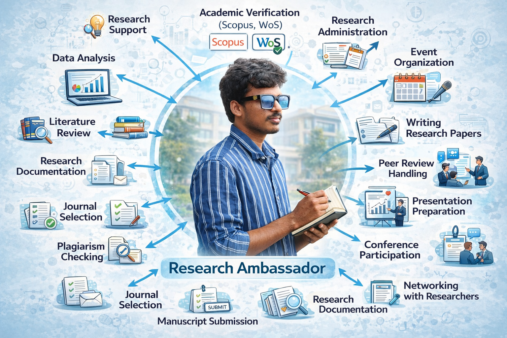

 **Researcher Research Assistant**

Researchers and analysts often fail not due to lack of time, but because they **cannot read and process all research papers, news articles, and documents efficiently**.  
This AI-powered tool uses **RAG (Retrieval-Augmented Generation)** to make research effortless. Users can **input article URLs or upload documents** and ask questions to instantly retrieve relevant insights.


## Background of the Problem


- During **B. Balaji's** 3-month internship as a **Research Ambassador**, we observed key challenges faced by researchers.
- Researchers struggle not due to lack of effort, but because of the **overwhelming volume of information**.
- Research papers, articles, and domain-specific documents are growing rapidly.
- It becomes difficult to **read, analyze, and extract meaningful insights** within limited time.
- A major issue is **information overload**, leading to:
  - Missed important insights  
  - Delayed decision-making  
- Existing AI tools often:
  - Generate **hallucinated (unreliable) answers**  
  - Reduce trust in automated research systems  
- To solve this, **We** developed a **no-hallucination AI-powered research platform** using **RAG (Retrieval-Augmented Generation)**.
- The system:
  - Uses **real user-provided data (URLs & documents)**  
  - Ensures **accurate, relevant, and verifiable responses**  
  - Helps researchers **save time and improve efficiency**
 
##  Design Prototype & Demo

**Preview the Interface:** [Click to View Figma Prototype](https://www.figma.com/design/HRj15NAtfudeKRGk4kTYUE/Untitled?node-id=0-1&t=8Z1ACNodrYPIkFnV-1)
##  Features

-  **URL-Based Research** – Extract, process, and query insights from multiple web articles  
- **Document Intelligence** – Upload PDFs, DOCX, CSV, and images for semantic search  
- **Smart AI Q&A** – Get accurate, context-aware answers with source references  
- **RAG Architecture** – Reduces hallucinations using retrieval-based responses  
- **Domain Extensible** – Works for real estate and adaptable to other domains  
-  **Fast & Scalable** – Efficient retrieval using vector databases (ChromaDB)  
-  **Source Transparency** – Answers backed by verifiable data  

### Set-up

1. Run the following command to install all dependencies. 

    ```bash
    pip install -r requirements.txt
    ```

2. Create a .env file with your GROQ credentials as follows:
    ```text
    GROQ_MODEL=MODEL_NAME_HERE
    GROQ_API_KEY=GROQ_API_KEY_HERE
    ```

3. Run the streamlit app by running the following command.

    ```bash
    streamlit run main.py
    ```

##  Team Contributions & Roles

| Name | Role | Key Contributions |
|------|------|------------------|
| **B. Balaji** | GenAI & Full Stack Developer | • Designed overall system architecture (RAG pipeline)<br>• Integrated frontend (Streamlit) & backend (FastAPI)<br>• Implemented LLM (Llama3 via Groq) and API workflows |
| **K. Surya Akhil Varma** | Backend & Data Engineer | • Built REST APIs using FastAPI<br>• Managed document processing & data pipelines<br>• Handled database (ChromaDB / MySQL) and embeddings |
| **K. Yuva Sankar** | Frontend & UI Developer | • Developed interactive UI using Streamlit<br>• Implemented user workflows (URL input, file upload, Q&A)<br>• Improved usability and responsiveness |
| **Navya Sree** | UI/UX Designer & Research Analyst | • Designed Figma prototypes and wireframes<br>• Created user journey and layout planning<br>• Conducted research on user needs & optimized UX |


---
Copyright (C) The Apollo University Inc. All rights reserved.

Additional Terms: This software is licensed under the MIT License. However, commercial use of this software is strictly prohibited without prior written permission from the author. Attribution must be given in all copies or substantial portions of the software.


